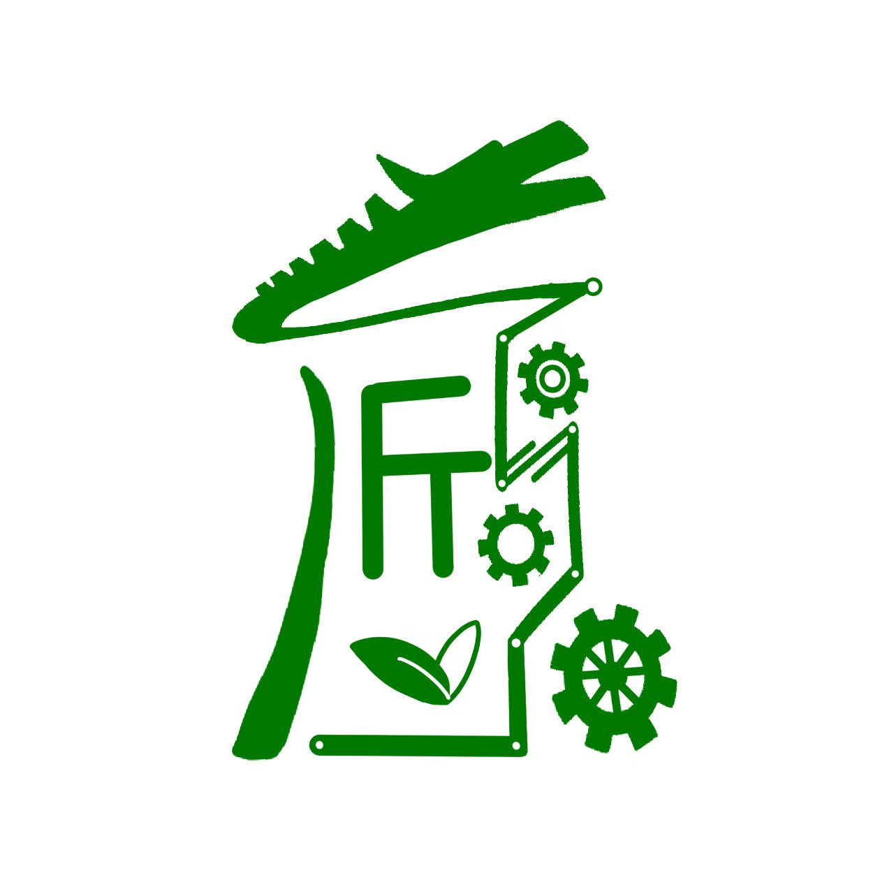

<p align="center">
  
</p>

<h1 align="center">匠心农场 🌱</h1>

<p align="center">
  智能灌溉 + 蓝牙机械臂 · 全栈物联网项目
  <br>
  <br>
  
  
  
  
  
  
</p>

---

## 这是什么

一个居家智能种植控制系统。手机远程监控土壤湿度、自动浇水，还能蓝牙控制一台四轴机械臂。

```
Arduino Uno ──UART── ESP-01S ──MQTT── 巴法云 ──HTTP── Flutter App (灌溉)
ESP32        ───────BLE──────────────────── Flutter App (机械臂)
```

---

## 功能

### 🌿 智能浇水

| 功能 | 说明 |
|------|------|
| 远程湿度监测 | 电容式传感器，0-100% 实时显示 |
| 自动滞回控制 | 低于下限开泵，高于上限关泵，中段保持 |
| 手动模式 | 随时开关水泵 |
| 双阈值调节 | App 拖滑块设上下限 |
| 保护锁 | 连续运行 60s 自动锁定，30min 自动恢复 |
| 自适应轮询 | 湿度变化 3s，稳定时 10s，省流量 |

### 🦾 蓝牙机械臂

| 功能 | 说明 |
|------|------|
| 四轴角度控制 | 旋转 / B 轴 / C 轴 / 夹爪，独立滑块 |
| 方向控制 | 上下左右前后 + 急停 |
| 预设位姿 | 复位 + 3 个可定制预设 |
| 逆运动学 | ESP32 端实时计算，App 发角度 / 固件算坐标 |

---

## 硬件清单

| 模块 | 型号 | 用途 |
|------|------|------|
| 主控 | Arduino Uno R3 | 传感器读取、水泵控制、LCD |
| 网桥 | ESP-01S | WiFi → MQTT，透明转发串口数据 |
| 传感器 | 电容式土壤湿度 | 非接触式，不腐蚀 |
| 继电器 | 5V 单路 | 控制水泵电源 |
| 水泵 | 微型潜水泵 | DC 5-12V |
| 屏幕 | LCD1602 I²C | 本地显示湿度/模式 |
| 机械臂主控 | ESP32 | BLE 蓝牙 + 舵机控制 |
| 舵机 ×4 | SG90 / MG995 | 旋转、B轴、C轴、夹爪 |
| 云平台 | 巴法云 | MQTT Broker + HTTP API |

---

## 快速开始

### 1. 烧录固件

按顺序烧录三个硬件：

| 步骤 | 文件 | 烧录工具 |
|------|------|----------|
| Arduino | `docs/hardware/arduino-pump.ino` | Arduino IDE |
| ESP-01S | `docs/hardware/esp8266-bemfa-pump.ino` | Arduino IDE |
| ESP32 机械臂 | `docs/hardware/mini_arm/` | PlatformIO |

ESP-01S 固件需要修改：
```cpp
const char* WIFI_SSID     = "你的WiFi名";
const char* WIFI_PASS     = "你的WiFi密码";
const char* BEMFA_UID     = "你的巴法云UID";
```

### 2. 编译 App

```bash
flutter pub get
flutter build apk --target-platform android-arm64
```

APK 在 `build/app/outputs/flutter-apk/app-release.apk`。

### 3. 运行

- Arduino + ESP + 传感器 + 水泵 上电
- ESP32 机械臂上电
- 手机装 APK
- App 底部切到「灌溉」Tab，等几秒看到湿度数字
- 切到「机械臂」Tab，扫描蓝牙连接 Mini-Arm

---

## App 界面

<p align="center">
  <em>灌溉 Tab · 机械臂 Tab · 设置 Tab</em>
</p>

| 灌溉 | 机械臂 | 设置 |
|------|--------|------|
| 湿度百分比 + 进度条 | BLE 设备扫描列表 | 巴法云 UID / 主题配置 |
| 水泵 ON/OFF 开关 | 四轴角度滑块 | 蓝牙设备名修改 |
| 自动/手动模式切换 | 方向控制板 | 连接日志查看 |
| 双阈值滑块 | 预设位姿 | 配置重置 |

---

## 传感器校准

电容式传感器个体差异大，首次使用需要标定：

你的实测值（放空气 478，放水里 220）已写入固件。换了新传感器的话修改 `arduino-pump.ino`：

```cpp
const int AIR_VALUE   = 你的空气读数;
const int WATER_VALUE = 你的水中读数;
```

感应面（有突起那面）朝向土壤，背面不感应。

---

## 项目结构

```
smart-farm/
├── lib/                         # Flutter App 源码
│   ├── main.dart                # 入口 + Provider 依赖组装
│   ├── app.dart                 # 三 Tab 导航壳
│   ├── domain/models/           # 数据模型
│   ├── data/services/           # HTTP / BLE / 存储服务
│   └── ui/                      # 界面 (ViewModels + Widgets)
├── docs/
│   ├── hardware/                # 固件源码
│   │   ├── arduino-pump.ino     # Arduino Uno 主控
│   │   ├── esp8266-bemfa-pump.ino  # ESP-01S MQTT 网桥
│   │   └── mini_arm/            # ESP32 机械臂 (PlatformIO)
│   ├── SMART_WATERING_PROTOCOL_V2.md  # 三端通信协议
│   ├── api-reference-flutter.md # 巴法云 HTTP API
│   └── BUG_TRACKER.md           # Bug 追踪
└── android/                     # Android 原生配置
```

---

## 技术栈

| 类别 | 技术 |
|------|------|
| App 框架 | Flutter 3.11 / Dart 3.11 |
| 状态管理 | Provider |
| HTTP | http + 巴法云 REST API |
| 蓝牙 | flutter_blue_plus |
| 设计 | Material Design 3 |
| 单片机 | Arduino / ESP8266 / ESP32 |
| 通信 | MQTT / BLE / UART |
| 固件框架 | Arduino Core / PlatformIO |

---

## 巴法云配置

App 默认使用 HTTP API 轮询（不直连 MQTT）：

| 参数 | 说明 |
|------|------|
| API 地址 | `https://apis.bemfa.com` |
| 控制主题 | `waterpump001` |
| 上报主题 | `waterpump001state` |
| 设备类型 | `5` (MQTT V2) |

首次启动 App 后在设置页填你的 UID。

---

## 许可证

MIT
